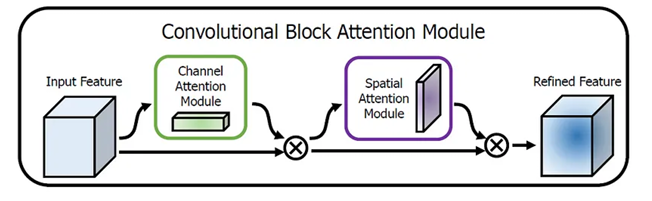
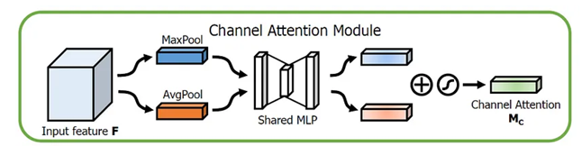
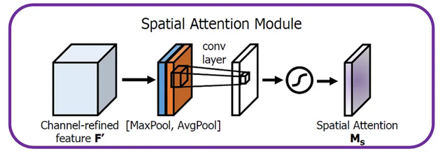
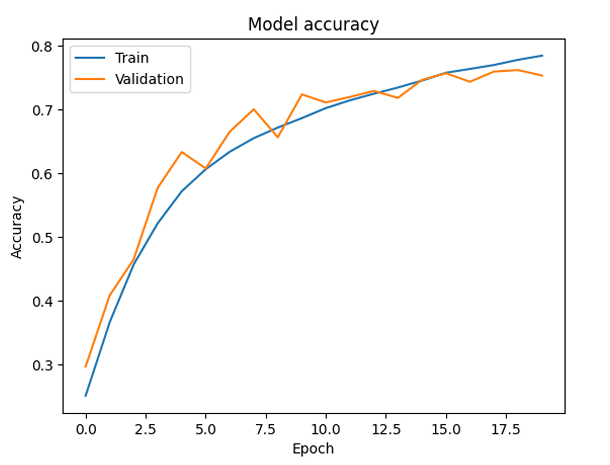
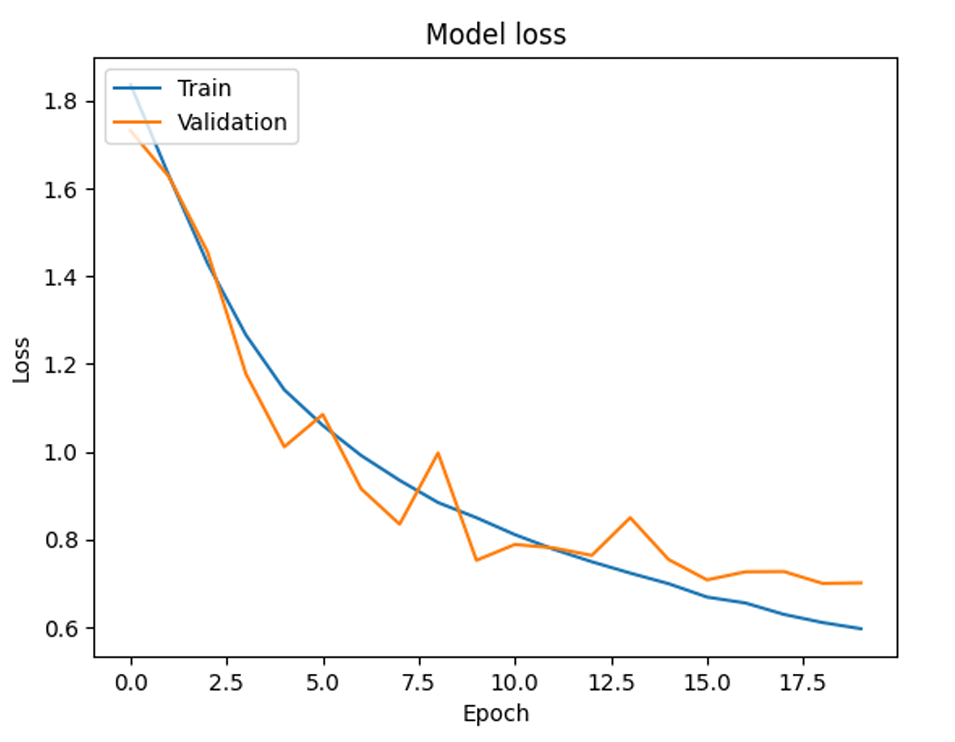
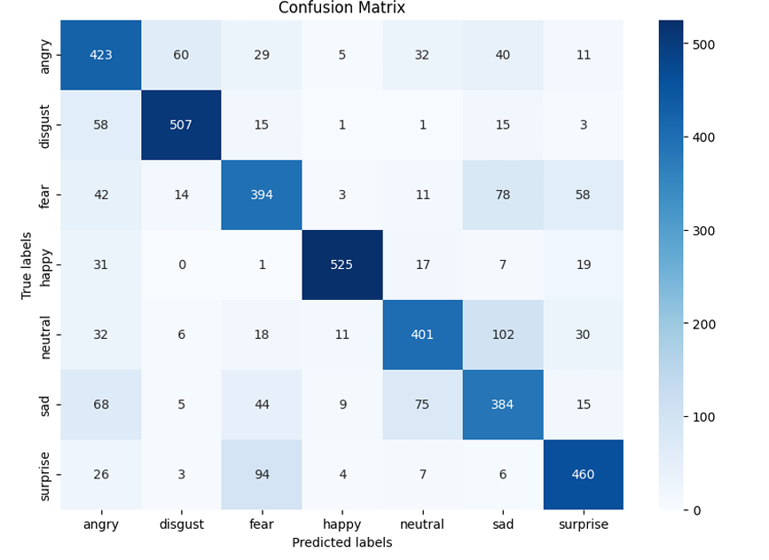
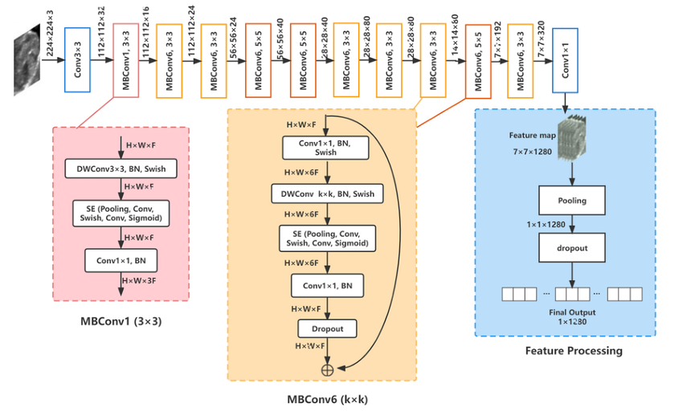
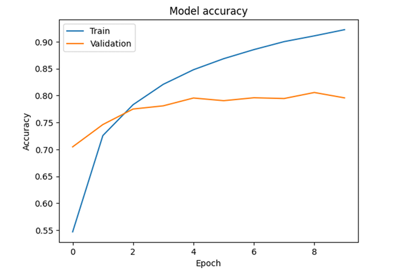
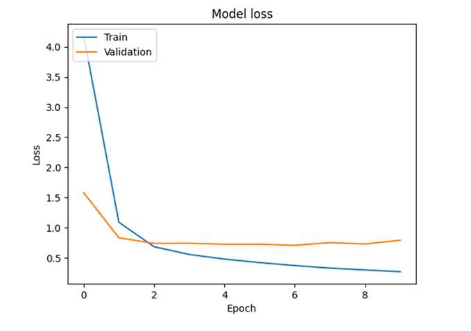
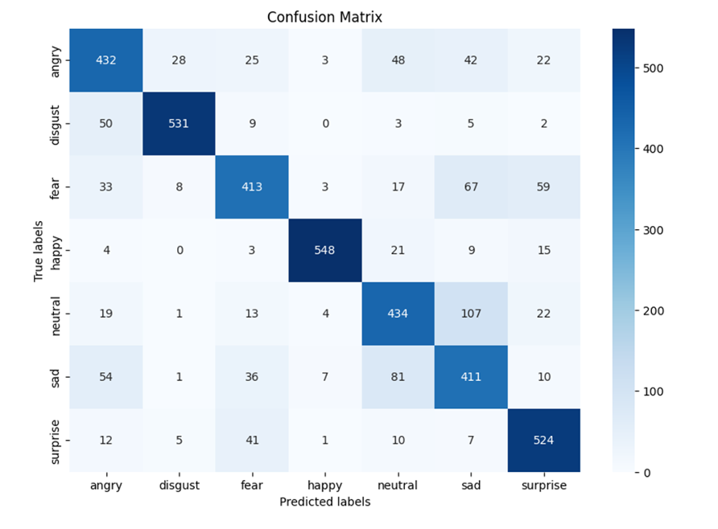

# Facial Expression Recognition (FER) using Deep Learning

## Project Overview
This project presents a Facial Expression Recognition (FER) system developed using advanced Deep Learning techniques. It aims to automatically classify human emotions from facial images into seven primary categories: **Angry, Disgust, Fear, Happy, Sad, Surprise, and Neutral.**

Two complementary approaches were explored and compared to achieve both interpretability and performance:

1. **CBAM-5CNN :** a custom-built Convolutional Neural Network designed from scratch and enhanced with the Convolutional Block Attention Module (CBAM).
This model focuses on learning the most relevant spatial and channel-wise features to boost interpretability and accuracy.

2. **EfficientNetB3 :** a state-of-the-art pretrained network fine-tuned for facial emotion recognition.
It leverages compound scaling to optimize depth, width, and resolution simultaneously, achieving strong results with high computational efficiency.

Both models were trained and tested on a newly curated dataset, FER2024_CK+, combining and improving the FER2013 and CK+ datasets to ensure diversity and quality.

## Objectives

* Develop and train deep learning models to automatically detect and classify facial emotions.  
* Compare the performance of a pretrained model versus a custom-built CNN.  
* Improve dataset quality through cleaning, relabeling, and augmentation.  
* Integrate attention mechanisms to enhance model focus on key facial features.  
* Evaluate model performance using quantitative metrics and visual analysis.  
* Explore the potential for real-time emotion recognition applications.

## Dataset Overview

| Dataset | Description | Images | Emotions | Source |
|----------|--------------|---------|-----------|---------|
| FER2013 | Grayscale facial expression dataset with seven emotion categories (48x48). | 35,887 | 7 | [FER2013 Dataset](https://www.kaggle.com/datasets/msambare/fer2013) |
| FER2024 | Cleaned and relabeled version of FER2013. | 35,784 | 10 | [FER 2024 Dataset](https://github.com/FERProject/FER24_CKPlus/releases/tag/FER24_CK%2B) |
| CK+ | High-quality dataset used for benchmarking facial expression recognition. | 920 | 7 | [CK+ Dataset](https://www.kaggle.com/datasets/shuvoalok/ck-dataset) |

* **Combined Dataset: FER2024_CK+**
 * Final dataset (7 common emotions).
 * Improved generalization by combining **CK+**’s clean samples with **FER2024**’s diversity.

# Deep Learning Architectures: CBAM-5CNN & EfficientNetB3

## 1. CBAM Architecture

The Convolutional Block Attention Module (CBAM) is a lightweight attention mechanism designed to refine feature maps in CNNs.
It sequentially applies **Channel Attention** and **Spatial Attention** to help the model focus on what and where to look in an image.

  * **Channel Attention Module**
    * Uses **global average pooling** and **max pooling** to summarize feature maps across spatial dimensions.
    * Each result passes through a **shared MLP**, then combined and activated with a **sigmoid** function.
    * Produces a **channel attention map**, applied elementwise to the input feature map.

  * **Spatial Attention Module**
    * Applies **average pooling** and **max pooling** across channels. 
    * Concatenates both results and passes them through a **convolutional layer** to generate a **spatial attention map**.
    * The map is multiplied elementwise with the previous output to highlight key spatial areas.

<figure>
  
  <figcaption><em>Figure 4:</em> CBAM-5CNN architecture illustrating convolutional blocks and attention mechanisms.</figcaption>
</figure>

<figure>
  
  <figcaption><em>Figure 5:</em> Channel Attention map highlighting the most informative feature channels.</figcaption>
</figure>

<figure>
  
  <figcaption><em>Figure 6:</em> Spatial Attention map focusing on key facial regions like eyes, eyebrows, and mouth.</figcaption>
</figure>

### CBAM-5CNN Architecture 🧠  

| **Block** | **Operations**                                           | **Output Shape** |
| ---------- | -------------------------------------------------------- | ---------------- |
| **1**      | Conv2D(64) + BN + CBAM + MaxPool + Dropout(0.25)        | (112×112×64)     |
| **2**      | Conv2D(128) ×2 + BN + CBAM + MaxPool + Dropout(0.25)    | (56×56×128)      |
| **3**      | Conv2D(256) ×3 + BN + CBAM + MaxPool + Dropout(0.3)     | (28×28×256)      |
| **4**      | Conv2D(512) ×3 + BN + CBAM + MaxPool + Dropout(0.3)     | (14×14×512)      |
| **5**      | Conv2D(512) ×3 + BN + CBAM + MaxPool + Dropout(0.4)     | (7×7×512)        |
| **Output** | Flatten + Dense(7, softmax)                              | 7 classes        |

> 🧩 **BN** = Batch Normalization  
> 🧩 **CBAM** = Convolutional Block Attention Module (Channel + Spatial Attention)

* **Optimizer:** Adam (learning rate = 0.0001)
* **Loss Function:** Categorical Crossentropy
* **Regularization:** Dropout, BatchNormalization  
* **Callbacks:** EarlyStopping, ReduceLROnPlateau  

#### Results

| Metric    | Training | Validation |
|-----------|----------|------------|
| Accuracy  | 80.55%   | 78.9%      |
| Precision | 84.31%   | 81.0%      |
| Recall    | 77.09%   | 75.4%      |

<figure>
  
  <figcaption><em>Figure 7:</em> Training and validation accuracy curves for CBAM-5CNN model.</figcaption>
</figure>

<figure>
  
  <figcaption><em>Figure 8:</em> Training and validation loss curves for CBAM-5CNN model.</figcaption>
</figure>

<figure>
  
  <figcaption><em>Figure 9:</em> Confusion matrix of CBAM-5CNN predictions across seven emotions.</figcaption>
</figure>

## 2. EfficientNet Architecture (Pretrained Model)

EfficientNet revolutionizes CNN scaling by **balancing depth, width, and resolution** using a compound scaling strategy.
It integrates **MBConv blocks** and **Squeeze-and-Excitation (SE)** modules for efficient and accurate feature extraction.

| **Component**    | **Purpose**                  | **Key Idea**                              |
| ---------------- | ---------------------------- | ----------------------------------------- |
| **MBConv Block** | Efficient feature extraction | Depthwise separable convolution           |
| **SE Block**     | Adaptive channel weighting   | Global pooling + dense layers + sigmoid   |
| **Compound Scaling** | Balanced model scaling       | Uniformly scales depth, width, resolution |

* **MBConv and SE Blocks**

| **Step** | **Operation**         | **Description**                              |
| -------- | --------------------- | -------------------------------------------- |
| **1**    | 1×1 Expansion         | Increases dimensionality for richer features |
| **2**    | Depthwise Convolution | Processes each channel independently         |
| **3**    | 1×1 Projection        | Reduces dimensionality to output size        |
| **4**    | Residual Connection   | Adds input to output if dimensions match     |

* **SE (Squeeze and Excitation) Block**

| **Phase** | **Operation**             | **Purpose**                                    |
| --------- | ------------------------- | ---------------------------------------------- |
| **1**     | Squeeze (Pooling)         | Summarize each channel into a scalar           |
| **2**     | Excitation (Dense Layers) | Generate adaptive weights using ReLU + Sigmoid |
| **3**     | Scale (Multiplication)    | Apply learned weights to feature maps          |

<figure>
  
  <figcaption><em>Figure 10:</em> EfficientNetB3 architecture used with transfer learning for facial emotion recognition.</figcaption>
</figure>

### EfficientNetB3 Architecture 🧠  

* **Base:** EfficientNetB3 (pre-trained on ImageNet)
* **Input Size:** 224×224×3
* **Fine-Tuning:** Last few layers retrained on FER2024_CK+
* **Regularization:** Dropout, L2 Regularization, EarlyStopping
* **Optimizer:** Adam
* **Loss:** Categorical Crossentropy
* **Batch Size:** 32  
* **Epochs:** 30  
* **Callbacks:** EarlyStopping, ModelCheckpoint, ReduceLROnPlateau

#### Results

| Metric    | Training | Validation |
|-----------|----------|------------|
| Accuracy  | 86.7%    | 83.7%      |
| Precision | 87.5%    | 86.1%      |
| Recall    | 84.8%    | 82.5%      |

<figure>
  
  <figcaption><em>Figure 11:</em> Training and validation accuracy curves for EfficientNetB3 model. [Source]</figcaption>
</figure>

<figure>
  
  <figcaption><em>Figure 12:</em> Training and validation loss curves for EfficientNetB3 model.</figcaption>
</figure>

<figure>
  
  <figcaption><em>Figure 13:</em> Confusion matrix of EfficientNetB3 predictions across seven emotions.</figcaption>
</figure>

## Comparative Analysis ⚖️

| Model         | Accuracy | Precision | Recall | F1-Score |
|---------------|----------|-----------|--------|----------|
| CBAM-5CNN     | 80.55%   | 84.31%    | 77.09% | 80.0%    |
| EfficientNetB3| 83.7%    | 86.1%     | 82.5%  | 84.3%    |

## Conclusion

* EfficientNetB3 achieved higher overall accuracy and stability.  
* The CBAM-5CNN model provided better interpretability and was computationally efficient.  
* Both models performed well, particularly for emotions such as Happy and Neutral.  
* Some misclassifications occurred between similar emotions (Fear vs Surprise).

## 🚀 Future Improvements

* Integrate multimodal cues (audio, gestures, contextual data).
* Extend dataset diversity across cultures and lighting conditions.
* Develop real-time FER systems for education, healthcare, and social robotics.

## Stay Curious and Keep Innovating ✨
## Happy learning !
